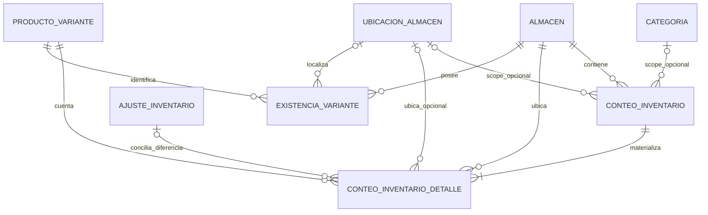

# ERD — ERP-N1.7 Conteos físicos

## Propósito

Este documento resume las relaciones persistentes relevantes de N1.7 y deja explícita la frontera entre evidencia de conteo y autoridad física de stock.

## Modelo lógico

## ConteoInventario

Cabecera documental del conteo.

Relaciones principales:

- `AlmacenId` — obligatorio; define el almacén del documento.
- `UbicacionAlmacenId` — opcional; obligatorio funcionalmente para tipo `PorUbicacion`.
- `CategoriaId` — opcional; obligatorio funcionalmente para tipo `PorCategoria`.
- `Detalles` — colección materializada antes de iniciar.

Campos de lifecycle relevantes:

- `Estado`;
- `FechaInicio` / `IniciadoPorUsuarioId`;
- `FechaCierre` / `CerradoPorUsuarioId`;
- `FechaAprobacion` / `AprobadoPorUsuarioId`;
- `FechaCancelacion` / `CanceladoPorUsuarioId` / `MotivoCancelacion`.

El documento no contiene una FK hacia `ExistenciaVariante` como autoridad mutable porque el conteo conserva snapshots históricos, no stock vivo.

## ConteoInventarioDetalle

Representa una línea física materializada dentro del conteo.

Clave física lógica:

`ProductoVarianteId + AlmacenId + UbicacionAlmacenId`

Cuando `UbicacionAlmacenId` es nulo, la clave normalizada utiliza el nivel raíz del almacén.

Relaciones:

- `ConteoInventarioId` — padre documental obligatorio.
- `ProductoVarianteId` — variante obligatoria.
- `AlmacenId` — almacén obligatorio.
- `UbicacionAlmacenId` — ubicación física opcional.
- `AjusteInventarioId` — nullable; sólo se materializa para diferencias que generan el ajuste formal posterior.

Evidencia histórica:

- `StockEsperadoSnapshot`;
- `SnapshotMaterializado`;
- `CantidadContada`;
- `Diferencia`;
- `FechaConteo`;
- `ContadoPorUsuarioId`;
- snapshots de SKU, marca, modelo, color y talla.

## ExistenciaVariante

`ExistenciaVariante` queda fuera del agregado documental de conteo y permanece como autoridad física.

La identidad física equivalente es:

`ProductoVarianteId + AlmacenId + UbicacionAlmacenId`

Al iniciar/materializar un conteo, el sistema toma `StockFisico` como snapshot esperado. Cerrar o aprobar no actualiza esa existencia.

## AjusteInventario

`AjusteInventario` es la frontera de escritura física posterior a la conciliación.

Una línea de conteo con `Diferencia != 0` puede vincularse a un `AjusteInventarioId` después de la aprobación. La confirmación del ajuste vuelve a validar la existencia autoritativa bajo sus reglas de concurrencia y genera la trazabilidad/Kardex correspondiente.

La FK nullable en detalle permite preservar conteos históricos que todavía no han generado ajuste y evita obligar a crear documentos artificiales para diferencias cero.

## Invariantes relacionales

1. Todas las líneas pertenecen al mismo `AlmacenId` de la cabecera.
2. Una línea no opera sin `ProductoVarianteId` y `AlmacenId` válidos.
3. La clave física de una línea no puede repetirse dentro del mismo conteo.
4. En conteo `PorUbicacion`, todas las líneas deben respetar `UbicacionAlmacenId` de la cabecera.
5. El snapshot debe existir antes de iniciar/capturar.
6. `AjusteInventarioId` sólo puede vincular una diferencia cerrada distinta de cero.
7. Una línea ya vinculada no puede apuntarse silenciosamente a otro ajuste.
8. Los snapshots nunca sustituyen `ExistenciaVariante.StockFisico` como autoridad.

## Privacidad de conteos ciegos

El ERD conserva `StockEsperadoSnapshot` porque es necesario para conciliación histórica, pero su existencia en persistencia no implica exposición API.

Mientras el conteo ciego no haya alcanzado cierre válido, la proyección de aplicación debe ocultar snapshot y diferencias derivadas para impedir inferencia matemática del stock.

## Borrado y preservación histórica

Las relaciones de N1.7 deben preservar histórico y evitar cascadas destructivas sobre catálogos/stock. El cierre o corrección funcional se realiza mediante lifecycle documental y ajustes formales; no mediante borrado físico de conteos ya auditables.

## Referencias canónicas

- `docs/ERP_N1_7_CONTEOS_FISICOS.md`
- `docs/ADR_N1_7_CONTEOS_CIEGOS_Y_AJUSTES.md`
- `docs/RUNBOOK_N1_7_CONTEOS_FISICOS.md`
- `ConteoInventario`
- `ConteoInventarioDetalle`
- `ExistenciaVariante`
- `AjusteInventario`
