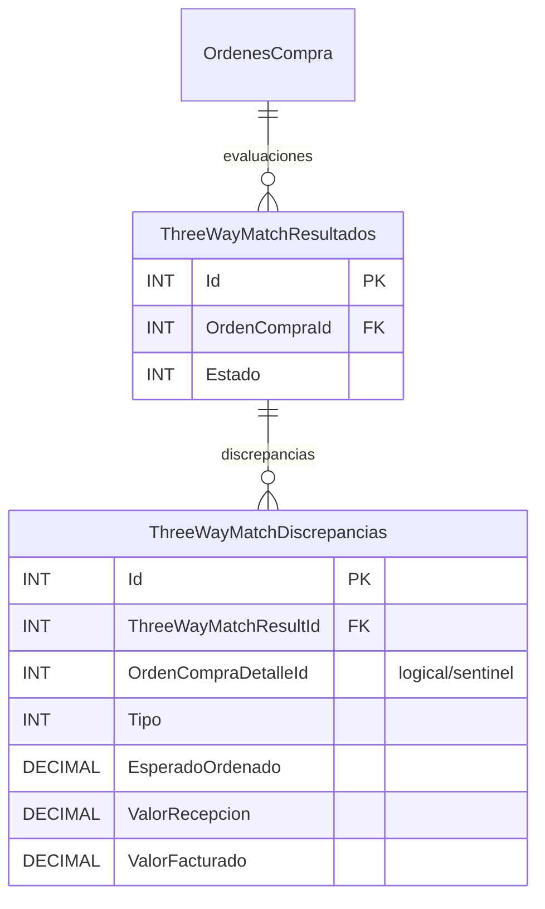

# ERD — N2.5 Three-Way Match

Persistencia canónica introducida por `20260821053500_N2_5_ThreeWayMatchPersistencia`.

## `ThreeWayMatchResultados`
- `Id` INT PK identity.
- `OrdenCompraId` INT NOT NULL.
- `Estado` INT NOT NULL: 0 Pendiente, 1 Aprobado, 2 Discrepancia.
- `FechaCreacion`, `FechaActualizacion`.
- Auditoría de creación/actualización por usuario/nombre.
- Check `CK_ThreeWayMatchResultados_OrdenCompraValida`: `OrdenCompraId > 0`.
- Check `CK_ThreeWayMatchResultados_EstadoValido`: `Estado IN (0,1,2)`.
- FK `FK_ThreeWayMatchResultados_OrdenesCompra_OrdenCompraId` hacia `OrdenesCompra(Id)` con `Restrict`.
- Índices por `OrdenCompraId` y por `(OrdenCompraId, FechaCreacion)`.

## `ThreeWayMatchDiscrepancias`
- `Id` INT PK identity.
- `ThreeWayMatchResultId` INT NOT NULL.
- `OrdenCompraDetalleId` INT NOT NULL; `0` es sentinela válido para discrepancias de cabecera.
- `Tipo` INT NOT NULL: 1 Cantidad, 2 Precio, 3 Descuento, 4 Impuesto, 5 Moneda.
- `EsperadoOrdenado`, `ValorRecepcion`, `ValorFacturado` DECIMAL(18,4).
- `Mensaje` VARCHAR(500).
- `EsperadoTexto`, `ValorFacturadoTexto` VARCHAR(500) NULL.
- Check `CK_ThreeWayMatchDiscrepancias_OrdenDetalleSentinela`: `OrdenCompraDetalleId >= 0`.
- Check `CK_ThreeWayMatchDiscrepancias_TipoValido`: `Tipo IN (1,2,3,4,5)`.
- FK `FK_ThreeWayMatchDiscrepancias_ThreeWayMatchResultados_ResultId` con `Cascade`.
- No existe FK física a `OrdenCompraDetalles`; se preserva deliberadamente el sentinela 0.

## Rollback
El `Down()` elimina primero `ThreeWayMatchDiscrepancias` y luego `ThreeWayMatchResultados`; por tanto elimina la evidencia N2.5 y requiere controles operativos destructivos antes de cualquier ejecución.
