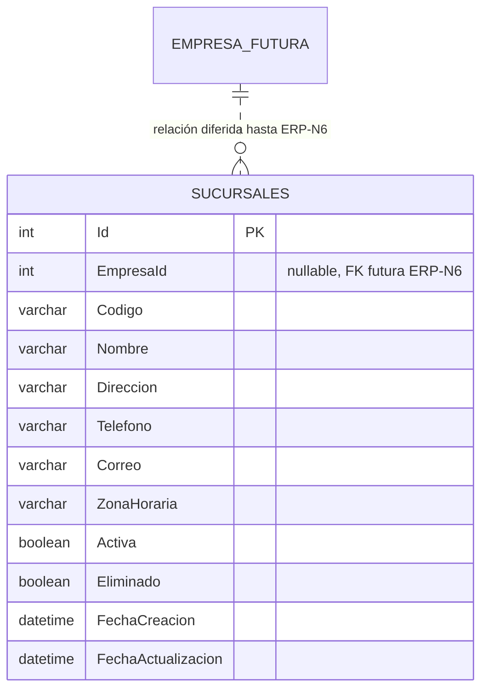

# ERP-N1.1 — Sucursales empresariales

Fecha de cierre técnico: 2026-08-14  
Plan rector: `PLAN_MAESTRO_ERP_V5`  
Rama autorizada: `Desarrollo`  
Estado: **✅ IMPLEMENTADO / MIGRADO / PROBADO / CERTIFICADO**

---

## 1. Objetivo

ERP-N1.1 introduce el maestro empresarial de **Sucursales** como primera capacidad de ERP-N1 Inventario Empresarial, con dominio, persistencia MySQL, API, RBAC relacional, auditoría, observabilidad, frontend responsive y QA end-to-end.

La implementación es deliberadamente compatible con la evolución futura a multiempresa, pero **no adelanta ERP-N6**: `EmpresaId` existe como identificador opcional de compatibilidad futura y todavía no representa una FK ni un límite tenant-aware.

### Fuera de alcance de N1.1

- Almacenes: ERP-N1.2.
- Ubicaciones internas: ERP-N1.3.
- Existencias por ubicación: ERP-N1.4.
- Aislamiento multiempresa/tenant real: ERP-N6.
- Cambios en `main` o Producción.

---

## 2. Autoridad de dominio

Entidad canónica:

```text
Sucursal
├─ Id
├─ EmpresaId?             # reserva futura ERP-N6
├─ Codigo
├─ Nombre
├─ Direccion?
├─ Telefono?
├─ Correo?
├─ ZonaHoraria
├─ Activa
├─ auditoría de creación/actualización
└─ soft-delete
```

Reglas finales:

1. `Codigo` se normaliza a mayúsculas y no puede quedar vacío.
2. `Nombre` no puede quedar vacío.
3. `ZonaHoraria` debe ser un identificador reconocido por `TimeZoneInfo`; el valor inicial es `America/Tegucigalpa`.
4. `EmpresaId`, cuando se informa, debe ser mayor que cero; **no crea una relación física antes de ERP-N6**.
5. Editar datos maestros no cambia `Activa`.
6. Activar/desactivar usa endpoints separados e idempotentes.
7. Eliminar es baja lógica; no se elimina físicamente la fila desde la API.
8. La ausencia de un grant RBAC requerido implica denegación.

---

## 3. Persistencia y migración

Migración:

```text
20260814175500_N1_1_SucursalPersistencia
```

Configuración EF:

```text
backend/src/Infrastructure/Persistence/Configurations/SucursalConfiguration.cs
```

Tabla:

```text
Sucursales
```

### 3.1 Índices y restricciones

- PK `Id` autoincremental.
- `UX_Sucursales_Codigo_Activo`: unicidad de `CodigoActivoUnico`.
- `IX_Sucursales_EmpresaId`.
- `IX_Sucursales_Estado` sobre `Activa, Eliminado`.
- `CodigoActivoUnico` es columna calculada `UPPER(TRIM(Codigo))` únicamente cuando `Eliminado = 0`.
- checks físicos para código y nombre no vacíos.

La columna calculada permite reutilizar un código después de una baja lógica sin debilitar la unicidad de sucursales operativas.

### 3.2 Estrategia forward-only y fail-closed

No existía una tabla histórica `Sucursales` que reconciliar. El preflight de la migración falla cerrado si detecta una tabla homónima fuera del historial esperado en vez de adoptarla implícitamente.

El `Down` también es fail-closed: solo permite retirar la tabla cuando no contiene filas. Por tanto, el rollback no destruye sucursales capturadas accidentalmente.

`AppDbContextModelSnapshot` fue reconciliado y recertificado con MySQL 8.4.

### 3.3 ERD lógico de N1.1



La relación punteada es exclusivamente documental; **no existe FK física ni autoridad tenant en N1.1**.

---

## 4. Aplicación y API

Componentes principales:

```text
Application/Interfaces/ISucursalRepository.cs
Application/Interfaces/ISucursalService.cs
Application/Services/SucursalService.cs
Application/Validators/SucursalValidators.cs
Infrastructure/Repositories/SucursalRepository.cs
API/Controllers/SucursalesController.cs
```

### 4.1 Contrato HTTP

| Método | Ruta | Permiso | Semántica |
|---|---|---|---|
| GET | `/sucursales` | `Sucursales:Ver` | búsqueda, filtros y paginación server-side |
| GET | `/sucursales/activas` | `Sucursales:Ver` | catálogo operativo activo |
| GET | `/sucursales/{id}` | `Sucursales:Ver` | detalle |
| POST | `/sucursales` | `Sucursales:Crear` | alta |
| PUT | `/sucursales/{id}` | `Sucursales:Editar` | edición de datos maestros |
| PATCH | `/sucursales/{id}/activar` | `Sucursales:Activar` | activación idempotente |
| PATCH | `/sucursales/{id}/desactivar` | `Sucursales:Desactivar` | desactivación idempotente |
| DELETE | `/sucursales/{id}` | `Sucursales:EliminarLogico` | baja lógica |

`GET /sucursales` admite:

```text
buscar
activa
empresaId
pagina
tamanoPagina
```

El tamaño de página queda limitado a 100.

El contrato de respuestas conserva el estándar vigente del repositorio (`ApiResponse` + `ExceptionHandlingMiddleware`); N1.1 no introduce un segundo formato de errores paralelo.

OpenAPI/Swagger se deriva del controller y de sus DTOs mediante la configuración global ya existente de ASP.NET Core.

---

## 5. RBAC y seguridad

Se añadió:

```text
ModuloSistema.Sucursales = 28
```

El catálogo persistible incluye:

```text
Ver
Crear
Editar
Activar
Desactivar
EliminarLogico
```

Los endpoints combinan `[Authorize]` con `RequierePermiso`. La autorización efectiva sigue la única autoridad RBAC consolidada en ERP-N0.4:

```text
Usuario.RolId -> Rol -> RolPermiso -> Permiso
```

No se añadió bypass por administrador. Los administradores obtienen acceso por grants relacionales explícitos y seed idempotente.

---

## 6. Auditoría y observabilidad

Las operaciones mutables registran auditoría con:

```text
Modulo = Sucursales
Entidad = Sucursal
ReferenciaId = Sucursal.Id
```

Se auditan crear, editar, activar, desactivar y eliminar lógicamente. Repetir una transición de estado ya satisfecha no genera una segunda escritura ni una segunda auditoría.

La infraestructura global añade usuario, IP, User-Agent y `CorrelationId`.

`/sucursales` se incorporó a `MedirRendimientoBusquedaFilter`. La métrica registra exclusivamente:

- ruta;
- duración;
- P50/P95;
- número de muestras;
- **longitud** del término de búsqueda;
- cantidad de resultados;
- estado HTTP;
- `CorrelationId`.

No se registra el término, código, dirección, teléfono, correo ni otra PII del filtro.

---

## 7. Frontend y UX

Rutas protegidas:

```text
/sucursales
/sucursales/nueva
/sucursales/:id/editar
```

Capacidades:

- búsqueda con debounce;
- filtro por estado;
- filtro opcional `EmpresaId` como compatibilidad futura;
- paginación server-side;
- estados loading/error/retry/empty;
- tabla desktop y cards móviles;
- activar/desactivar separado de edición;
- confirmación de baja lógica;
- formulario con validaciones y zona horaria IANA;
- acciones visibles únicamente según permisos runtime;
- navegación lateral condicionada por `Sucursales:Ver`;
- soporte responsive, foco, teclado y atributos ARIA.

No se creó un selector de Empresa ni una jerarquía tenant ficticia.

---

## 8. QA y certificación

### 8.1 Commits funcionales

```text
N1.1.B dominio/contratos:
0a576db21e583a76418ce037ca53f8c30d3b7eb1

N1.1.C persistencia:
3ca70a8b41125ba501b9d94261e43d9dcd269df9
65785999934d8f02ffdf947fa24f48ceb9059076

N1.1.D aplicación/API/RBAC:
c511039680938fb758c60cf199a0c665462c7e79
805818140ef78183e52a17d196f36c452d39ebc2

N1.1.E frontend/UX:
d3009e051ffea91631673dc764e56fdf8cab70b2

N1.1.F seguridad/observabilidad:
9ead42f594aea12c20612d7c15e21768c090f828

N1.1.G QA base:
704d451e216ab4a48042ae8bfaca5995d77e9cdb

Fix descubierto por E2E:
b82c8d8325866fdf4408e22424fefe692965b8d9

HEAD certificado de G:
42a241162dc54c8fddf040a7321d57dd229f7e5b
```

### 8.2 Workflow dedicado permanente

```text
.github/workflows/n1-1-sucursales-ci.yml
ERP-N1.1 - Certificación Sucursales
```

Certificación final:

```text
Run: 31830346962
Job: 94864277702
Resultado: SUCCESS
```

Valida en un entorno descartable:

1. restore .NET;
2. build Release con warnings como error;
3. unit tests;
4. MySQL 8.4;
5. migraciones y readiness;
6. npm ci;
7. lint Angular;
8. build producción;
9. Chromium/Playwright;
10. Angular real;
11. E2E específico de Sucursales;
12. publicación de evidencia.

El E2E cubre:

- `401` sin autenticación;
- `CorrelationId` autenticado;
- creación y normalización;
- rechazo de código duplicado;
- auditoría de creación;
- búsqueda/filtros/paginación;
- desactivación idempotente sin auditoría duplicada;
- exclusión de inactivas del catálogo operativo;
- edición sin mutar estado;
- reactivación;
- UI autenticada y rutas protegidas;
- viewport móvil sin overflow horizontal;
- soft-delete y auditoría de eliminación.

### 8.3 Defecto real descubierto durante QA

El primer run dedicado (`31829945647`) creó correctamente una Sucursal pero detectó un `500` al consultar Auditoría con `accion=Crear`.

Causa raíz:

```text
AuditoriaRepository filtraba enums con enum.ToString() dentro de LINQ/EF.
```

Esa expresión no era traducible de forma segura por EF/MySQL. Se corrigió a:

```text
Enum.TryParse<TEnum>() + comparación tipada
```

Los filtros enum inválidos retornan conjunto vacío de forma fail-closed. El workflow N1.1 incluye ahora `AuditoriaRepository.cs` en sus paths para que futuras modificaciones vuelvan a ejecutar esta certificación.

El rerun final `31830346962` quedó completamente verde.

---

## 9. Rollback y recuperación

### Código

Solo se permiten correcciones forward-only en `Desarrollo`. No se hace force-push ni se modifica `main`.

### Base de datos

La migración es aditiva. El `Down` únicamente retira `Sucursales` cuando la tabla está vacía. Si existen filas, falla cerrado para impedir pérdida de datos.

### Incidente de aplicación

Ante una regresión funcional:

1. conservar la tabla y datos;
2. detener la promoción del commit afectado;
3. corregir forward-only en `Desarrollo`;
4. ejecutar `ERP-N1.1 - Certificación Sucursales`;
5. no promover mientras el certificado no sea `SUCCESS`.

N1.1 no autoriza despliegue ni migración en Producción.

---

## 10. Definition of Done

- [x] Dominio y contratos definidos.
- [x] Persistencia forward-only y fail-closed.
- [x] Snapshot EF reconciliado.
- [x] Migración real MySQL 8.4 validada.
- [x] API CRUD + activación/desactivación + soft-delete.
- [x] Filtros y paginación server-side.
- [x] RBAC relacional sin bypass.
- [x] Auditoría por entidad/referencia/correlation ID.
- [x] Observabilidad segura sin PII.
- [x] Frontend responsive y accesible.
- [x] Unit tests y regresión transversal.
- [x] E2E específico de Sucursales.
- [x] Defecto encontrado por E2E corregido y recertificado.
- [x] Workflow dedicado permanente.
- [x] `main` y Producción sin cambios.

**ERP-N1.1 queda técnicamente cerrado.**

Siguiente punto elegible del plan: **ERP-N1.2.A — Almacenes / auditoría y preflight**.
